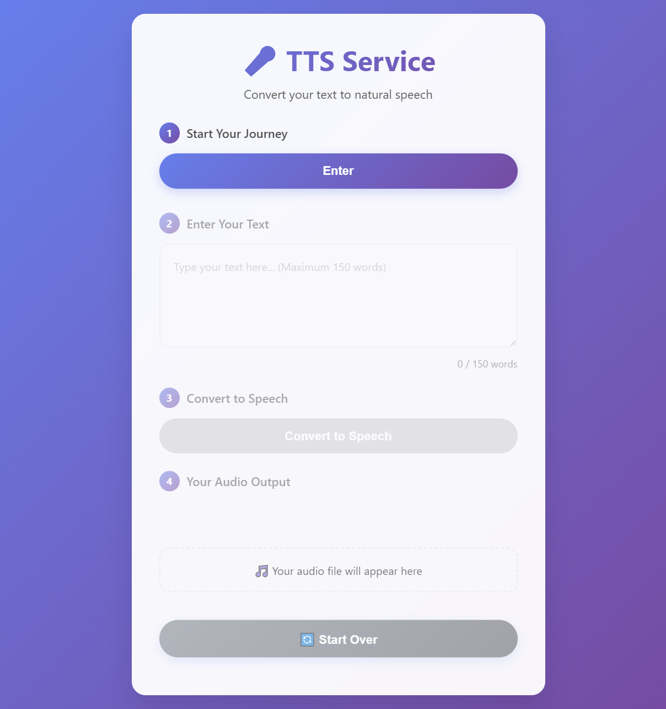

# Text-to-Speech Application

<!-- Add your frontend screenshot/demo image here -->


## Overview

A modern Text-to-Speech (TTS) application built using open-source TTS models. This project provides a simple and intuitive interface for users to convert text input into high-quality audio output.

## Features

- 🎯 **Simple Text Input**: Easy-to-use interface for entering text
- 🔊 **High-Quality Audio**: Leverages advanced open-source TTS models
- 🚀 **Fast Processing**: Quick text-to-speech conversion
- 💻 **User-Friendly Interface**: Clean and responsive frontend design
- 🔧 **Customizable**: Built with flexibility for future enhancements

## Status

🚧 **Under Construction** - This project is currently in active development. More features and improvements are coming soon!

## Getting Started

### Prerequisites

- Python 3.8+
- Node.js (if using web frontend)
- Required dependencies (see requirements.txt)

### Installation

1. Clone the repository
```bash
git clone https://github.com/yourusername/your-tts-project.git
cd your-tts-project
```

2. Install dependencies
```bash
pip install -r requirements.txt
```

3. Run the application
```bash
python app.py
```

## Usage

1. Launch the application
2. Enter your text in the input field
3. Click the "Generate Audio" button
4. Download or play the generated audio file

## Technology Stack

- **TTS Model**: [Specify the open-source TTS model you're using]
- **Backend**: Python
- **Frontend**: [Your frontend technology - React/HTML/etc.]
- **Audio Processing**: [Audio libraries you're using]

## Contributing

Contributions are welcome! Please feel free to submit a Pull Request. For major changes, please open an issue first to discuss what you would like to change.

1. Fork the project
2. Create your feature branch (`git checkout -b feature/AmazingFeature`)
3. Commit your changes (`git commit -m 'Add some AmazingFeature'`)
4. Push to the branch (`git push origin feature/AmazingFeature`)
5. Open a Pull Request

## Roadmap

- [ ] Complete basic TTS functionality
- [ ] Add voice selection options
- [ ] Implement audio speed controls
- [ ] Add batch processing capability
- [ ] Mobile app support
- [ ] API endpoints for developers

## License

This project is licensed under the MIT License - see the [LICENSE](LICENSE) file for details.

## Acknowledgments

- Thanks to the open-source TTS model developers
- Community contributors and testers
- [Any other acknowledgments]

## Contact

Your Name - [@yourusername](https://twitter.com/yourusername) - your.email@example.com

Project Link: [https://github.com/yourusername/your-tts-project](https://github.com/yourusername/your-tts-project)

---

⭐ If you found this project helpful, please give it a star on GitHub!
