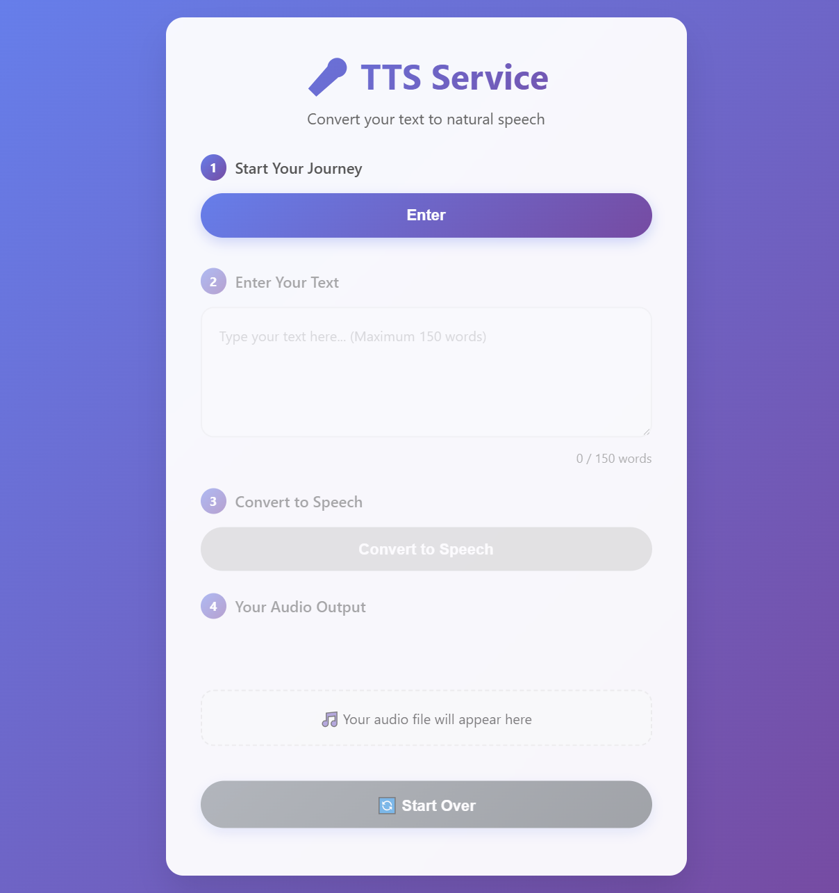

# Text-to-Speech Application

<!-- Add your frontend screenshot/demo image here -->


## Overview

A modern Text-to-Speech (TTS) application built using open-source [ChatTTS]([https://example.com](https://github.com/2noise/ChatTTS)) model. The aim for this application is to provide a simple & easy way for the user to create Text To Speech without going into the details or hasle of commands execution. 

## Features

- 🎯 **Simple Text Input**: Easy-to-use interface for entering text
- 🔊 **High and Realistic Audio**: Leverages the awesome "ChatTTS" model.
- 🚀 **Fast Processing**: Quick text-to-speech conversion
- 💻 **User-Friendly Interface**: Clean and responsive frontend design
- 🔧 **Customizable**: Built with flexibility for future enhancements

## Status

🚧 **Under Construction** - This project is currently in active development. Not ready to be used yet. More features and improvements are coming soon!

## Getting Started

### Prerequisites

- Python 3.8+
- Required dependencies (see requirements.txt)

### Installation

1. Clone the repository
```bash
git clone https://github.com/SanaUllah04/Text-To-Speech-Service.git
cd .\FrontEnd\
```

OR Just simply open the index.html file with any webbrowser [Google, FireFox, Edge etc]


2. Install dependencies
```bash
pip install -r requirements.txt
```

3. Run the application
```bash
python app.py
```

## Usage

1. Launch the application
2. Enter your text in the input field
3. Click the "Generate Audio" button
4. Download or play the generated audio file

## Technology Stack

- **TTS Model**: [Specify the open-source TTS model you're using]
- **Backend**: Python
- **Frontend**: [Your frontend technology - React/HTML/etc.]
- **Audio Processing**: [Audio libraries you're using]

## Contributing

Contributions are welcome! Please feel free to submit a Pull Request. For major changes, please open an issue first to discuss what you would like to change.

1. Fork the project
2. Create your feature branch (`git checkout -b feature/AmazingFeature`)
3. Commit your changes (`git commit -m 'Add some AmazingFeature'`)
4. Push to the branch (`git push origin feature/AmazingFeature`)
5. Open a Pull Request

## Roadmap

- [ ] Add voice selection options
- [ ] Implement audio speed controls
- [ ] Add batch processing capability
- [ ] Mobile app support
- [ ] API endpoints for developers

---

